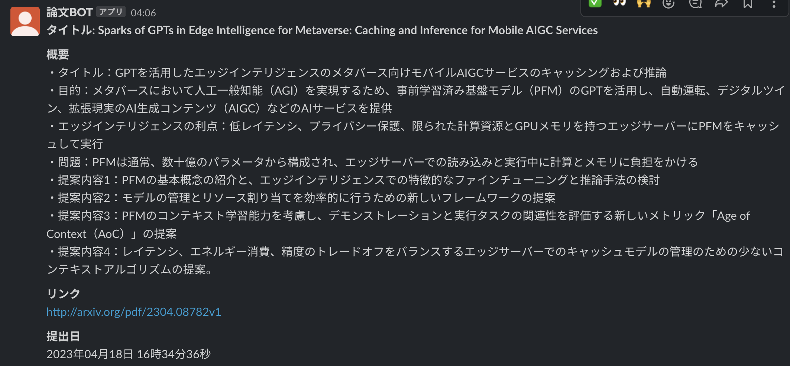
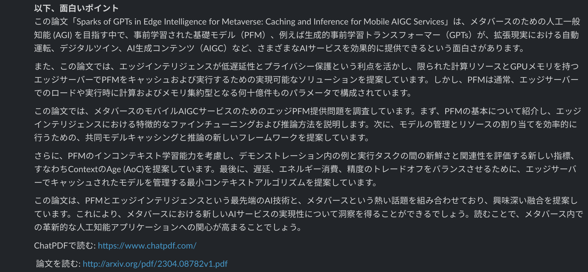

# 論文投稿 Slack BOT

arXiv から特定のキーワード、特定の著者の論文を検索し、それを Slack に投稿する BOT です。1 時間に一回、特定の Slack チャンネルに論文の情報を分かりやすく投稿してくれます。

特徴としては、以下二つがあります。

## 論文を読む入り口の体験の向上

自分みたいな研究者でない人でも読みやすいように論文の abstract をもとにした要約や、なぜその論文は魅力的なのかをわかりやすく解説してもらうことで、論文を読んでみようかな思えるようにしています。

これだけでは論文の内容を把握することは難しいですが、ざっくりどのようなテーマなのかを把握したり、読もうかなと興味を持てるようにするということに焦点を当てています。





## 論文を読む体験の向上

いきなり英語の論文を読むのは難しいですよね。ということで私は以下二つのアプローチをとっています。

### 1. ChatPDF を使った対話形式で疑問を解消していく

[ChatPDF](https://www.chatpdf.com/) は論文の PDF を読み込ませると、その論文内容に基づいて会話ができるサービスです。

論文に書いてないことは、書いてないとある程度明記した上で解答をしてくれるので、比較的 hallucination のリスクは低いのかなと思っています（完全ではないと思いますが）。

この対話形式で論文の内容を把握していくと、この論文の起点となった課題感や新規性、今後の課題、手法の詳細についてなどを一通り質問しておくとざっくり内容が理解できます。また論文の内容を受けた自分の解釈が合っているかのすり合わせができたり、専門用語を噛み砕いて教えてもらったりできるので有用です。

Slack 投稿の下部に ChatPDF の URL と、論文 PDF の URL を載せています。この論文 PDF の URL をコピーして、ChatPDF の Find a URL に貼り付けるとすぐ会話ができるような体験となっています。


### 2. Readable を使って PDF 翻訳をして読む

ステップ 1 が完了した頃には、論文の全体像や詳細なども少し掴めてきているはずです。このタイミングで [Readble の Chrome 拡張機能](https://chrome.google.com/webstore/detail/readable/pmhcplemclcflofgnjfhoilpkclnjnfh?hl=ja)を使って PDF を翻訳し、実際の原文を読み進めていきます。この [Readble](https://readable.jp/) は PDF のフォーマットを保った状態で翻訳してくれる神ツールです。使わない手はありません。


## 使い方

### 事前準備

事前準備として、以下を対応している必要があります。ここでは触れずに参考記事のみの紹介とさせていただきます。

- slackbot と slack channel の作成（最終的に `SLACK BOT TOKEN`, `SLACK CHANNEL ID` が取得できれば OK）
- Railway のアカウント発行、プロジェクト作成、Railway CLI のインストール

slackbot の作成については[こちら](https://www.pci-sol.com/business/service/product/blog/lets-make-slack-app/)がわかりやすいです（手順 1~17 までをなぞって下さい）。また Railway のアカウント発行とプロジェクト作成については[こちら](https://docs.railway.app/develop/cli)をご参考ください。

### インストール

以下の環境で実行しています。

- pip 23.0.1
- Python 3.10.6
- railwayapp 3.0.21

railwayCLI のインストール方法については[こちら](https://docs.railway.app/develop/cli)をご参考ください。

以下のコマンドを実行して必要なパッケージをインストールします。

```bash
pip install -r requirements.txt
```

### ローカル環境での動作確認

まずは.env.example のファイルをコピーして `.env` ファイルを作成して下さい。ここに SLACK BOT TOKEN、投稿したいチャンネルのチャンネル ID（SLACK_CHANNEL）、OPENAI_API_KEY を入力します。合わせてどのキーワードで論文を検索した以下についても設定できます。

次に、Railway CLI を使って、ローカル環境で実際に動かします。以下のコマンドを実行すると確認できます。

```bash
make run
```

この状態でも Slack に論文を投稿することはできますが、PC がスリープモードになると投稿が止まってしまいます。常時動かしたい時はデプロイをしましょう。

### Railway へのデプロイ

デプロイをすることで、PC が起動していない時でも論文投稿がされるようになります。今回は Railway へのデプロイを行います。

Railway のプロジェクトと CLI をリンクしていなければ、下記を実行して下さい。

```bash

railway login

railway link

```

問題なければ、以下を実行するとビルド・デプロイが始まります。

```bash

make deploy

```

それでは論文読書ライフを楽しみましょう！💪
